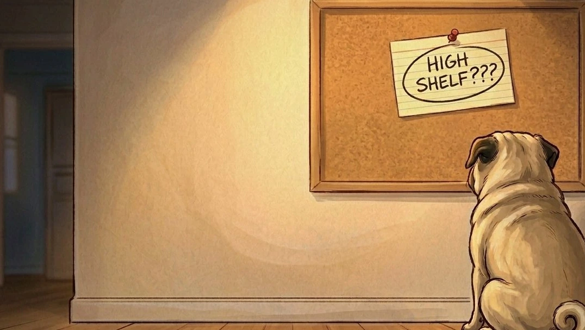
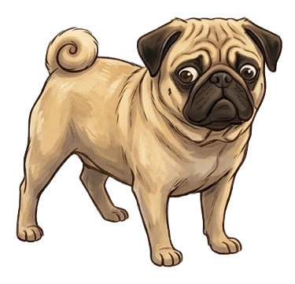
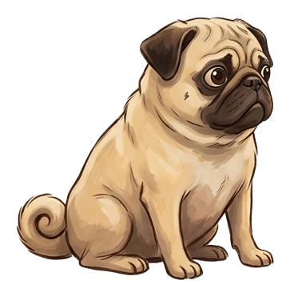
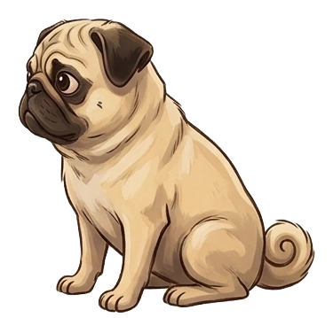
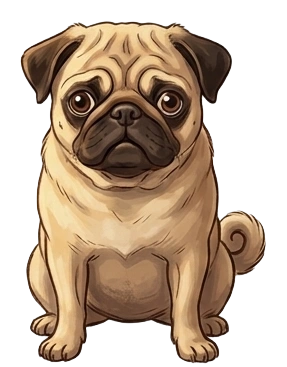

 

  
  
  

 

<h1 align="center">Bruce Investigates</h1>

<em>A digital children's picture book about a very serious pug on a very important case.</em>

  <a href="https://bytiagodev.github.io/bruce-investigates/">Read the book</a>

 

---

## The Case

The owners left this morning. Bruce is home alone.

What follows is a thorough, professional, and completely serious investigation. Bruce takes himself very seriously. The stakes, it must be said, are not serious at all.

> *"He was given a treat. It was fine. It was not enough."*

 

  

 

---

## The Book

13 spreads and a cover. Each page is a full 16:9 painted illustration with sparse text overlay. Warm domestic interiors, low camera angles, and an earthy muted palette create a world that feels slightly oversized from Bruce's perspective.

The comedy comes from Bruce taking himself completely seriously throughout. His expression barely changes. The chaos accumulates behind him and he never looks at it.

Choose your language, start the investigation and turn pages by clicking, dragging, or using the arrow keys. On mobile, tap the edges.

 

  

 

---

## About Bruce

  

Bruce is a real pug.

This book exists because as coding became a bigger part of my life, I wanted Bruce to be part of it too, represented somewhere in the things I make. The repo is for him more than anything else. If other people find enjoyment in it, that is great. I am sure Bruce would be happy to know he made someone smile. He has always been more than happy to make others smile alongside him.

More than a portfolio piece. More than a tech demo. This is a book for him, from him.

 

---

## Under the Hood

No backend. No API. No accounts. This is a book, not an app. The only thing running is the page flip.

| What | How |
|---|---|
| The bones | React 18 via Vite |
| The page turn | react-pageflip |
| The transitions | Framer Motion |
| The style | Tailwind CSS |
| The home | GitHub Pages |

 

---

## Credits

| | |
|---|---|
| Concept, writing, and build | [bytiagodev](https://github.com/bytiagodev) |
| Bruce | for being a lovely and loyal boy who never fails to brighten my day |

 

---

  

<em>He is a very good boy.</em>
