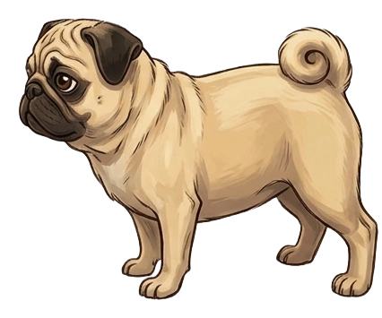

  

  
  
  

<h1 align="center">Bruce Investigates</h1>

<em>A digital picture book about a very serious pug on a very important case.</em>

  <a href="https://bytiagodev.github.io/bruce-investigates/">📖 Read the book</a>

---

## The case

Bruce is my pug. When the house is empty, he takes his job as head of security very seriously. This is a short digital picture book about what happens when he works out that the treats have been moved and the owners are the prime suspects.

He searches the kitchen floor, the sofa cushions and the cupboard under the sink. Something falls. Bruce did not do that.

  

## The evidence

Thirteen illustrated spreads, plus a cover, endpapers and a closing page, so it opens and closes like a real picture book rather than stopping after the last image. I wrote the story and put the illustrations together, keeping the camera low to match how Bruce actually sees a room.

The book opens on a language choice, English or Portuguese, and the whole book follows it. Pages turn by clicking, dragging or using the arrow keys, and by tapping the edges of the screen on a phone. Every turn plays a paper sound that is generated in the browser rather than loaded as a file, so nothing extra is downloaded to make the book feel physical.

  

## The subject

  

Bruce is my actual dog. As coding became a bigger part of my life, I wanted him to be represented in the things I make. This repository is for him more than anything else. If other people enjoy it, that is a bonus, but mostly it is here to celebrate a very good boy.

## The paperwork

  

No backend, no database, no accounts. A static site on GitHub Pages, built with React and Vite, with `react-pageflip` handling the book mechanics, Framer Motion handling the transitions, and Tailwind for the styling. Text sizes scale with the rendered page rather than the viewport, so a spread reads the same on a laptop and on a phone.

## Credits

Concept, writing and build by [bytiagodev](https://github.com/bytiagodev). Everything else I have made is at [bytiago.com](https://bytiago.com/).

Bruce, for being a lovely and loyal boy who never fails to brighten my day.

---

  

<em>He is a very good boy.</em>

